# Diagrama de Arquitectura - Optimización MaalCa Web

## 🏗️ Arquitectura Actual vs. Propuesta

### Arquitectura Actual (PROBLEMÁTICA)

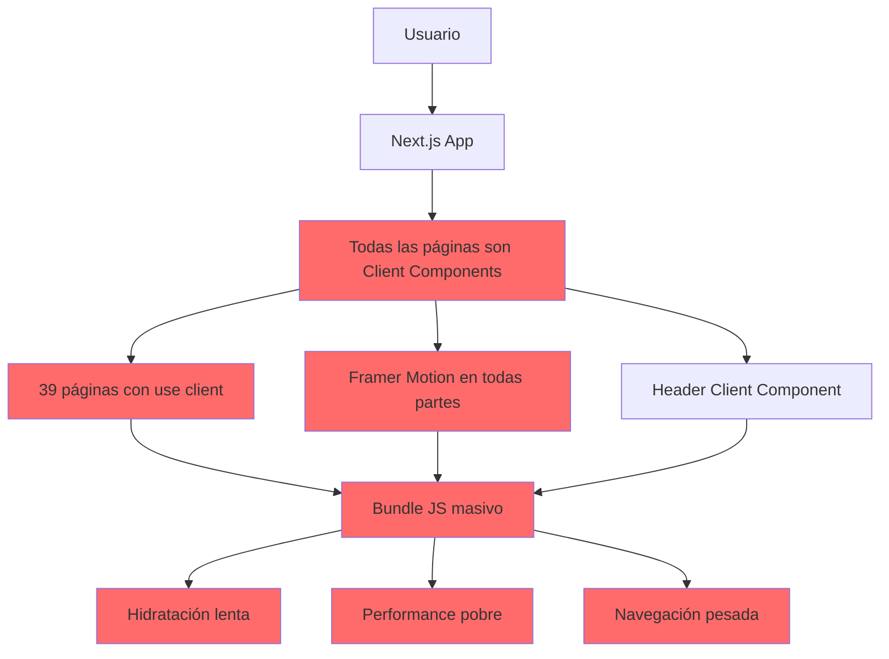

### Arquitectura Propuesta (OPTIMIZADA)

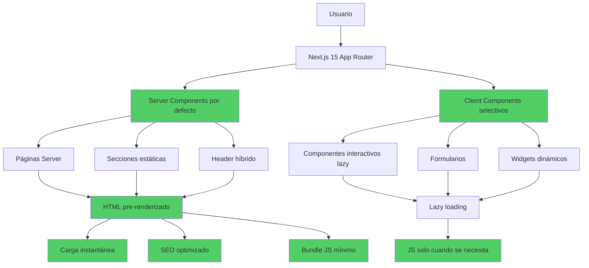

---

## 📦 Estructura de Componentes

### Componentes por Tipo

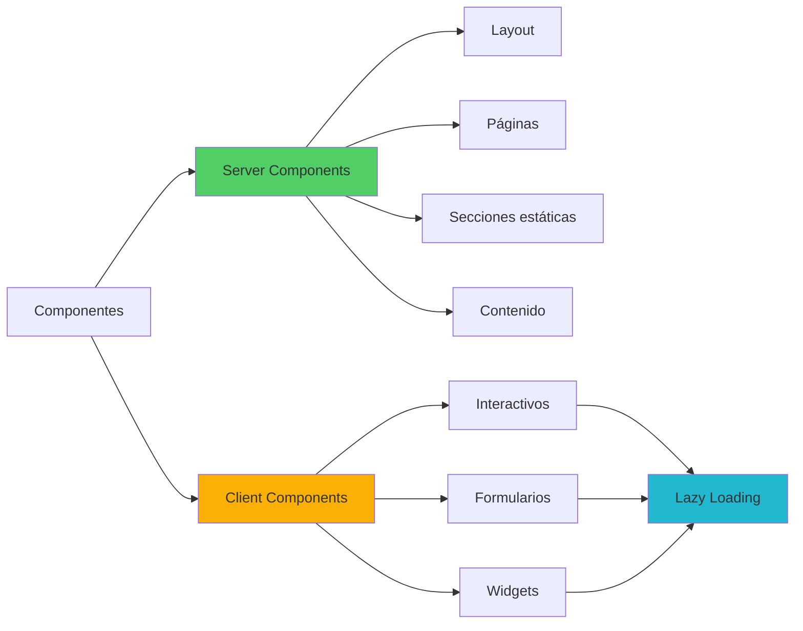

---

## 🔄 Flujo de Carga de Página

### Página Landing (Marketing)

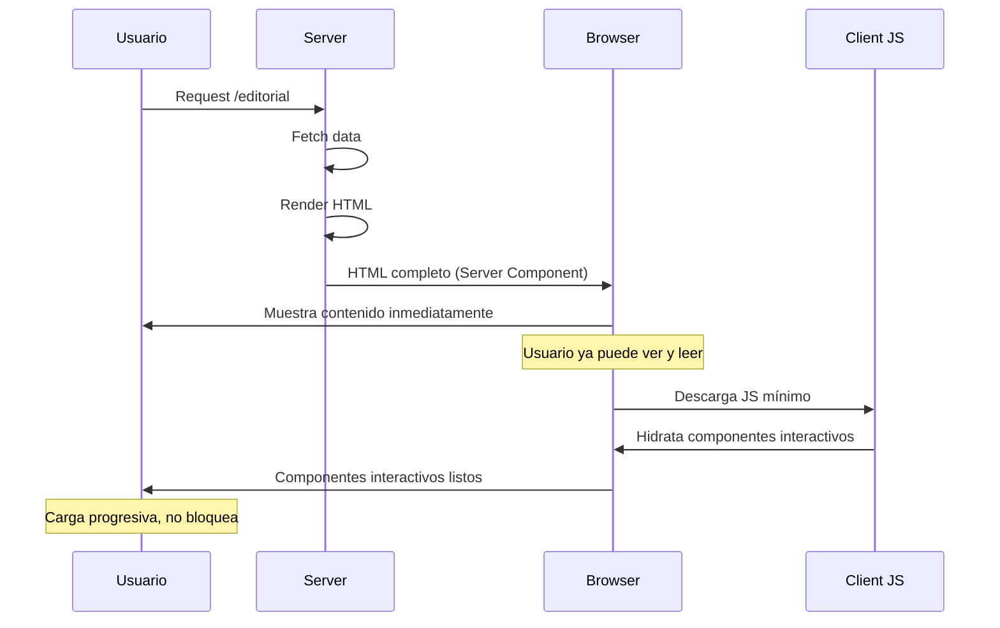

### Página de Afiliado (con Commerce)

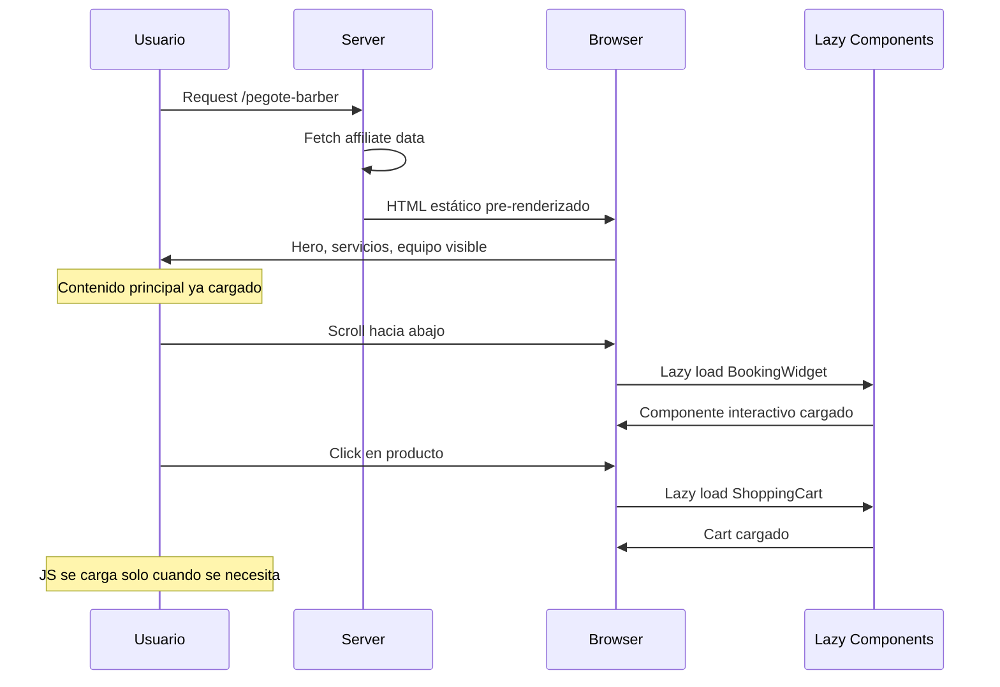

---

## 🗂️ Organización de Archivos

### Estructura Actual

```
src/
├── app/
│   ├── page.tsx ("use client" ❌)
│   ├── layout.tsx
│   ├── editorial/
│   │   └── page.tsx ("use client" ❌)
│   ├── pegote-barber/
│   │   └── page.tsx ("use client" ❌)
│   └── dashboard/
│       └── page.tsx ("use client" ❌)
└── components/
    ├── Header.tsx ("use client" ❌)
    └── (componentes mezclados)
```

### Estructura Propuesta

```
src/
├── app/
│   ├── page.tsx (Server ✅)
│   ├── layout.tsx (Server ✅)
│   │
│   ├── editorial/
│   │   └── page.tsx (Server ✅)
│   │
│   ├── [affiliate]/
│   │   └── page.tsx (Server ✅)
│   │
│   └── dashboard/
│       ├── layout.tsx (Client - necesario)
│       └── [affiliateId]/
│           └── page.tsx (Server con datos iniciales ✅)
│
└── components/
    ├── layout/
    │   ├── Header.tsx (Server ✅)
    │   ├── NavBar.tsx (Server ✅)
    │   └── MobileMenu.tsx (Client lazy)
    │
    ├── sections/ (Server ✅)
    │   ├── HeroSection.tsx
    │   ├── FeaturesGrid.tsx
    │   └── CTASection.tsx
    │
    ├── interactive/ (Client lazy)
    │   ├── BookingWidget.tsx
    │   ├── ShoppingCart.tsx
    │   └── ContactForm.tsx
    │
    └── ui/
        ├── base/ (Server ✅)
        │   ├── Button.tsx
        │   ├── Card.tsx
        │   └── Typography.tsx
        │
        └── client/ (Client)
            ├── Modal.tsx
            └── Dropdown.tsx
```

---

## ⚡ Flujo de Optimización por Página

### Conversión de Client a Server Component

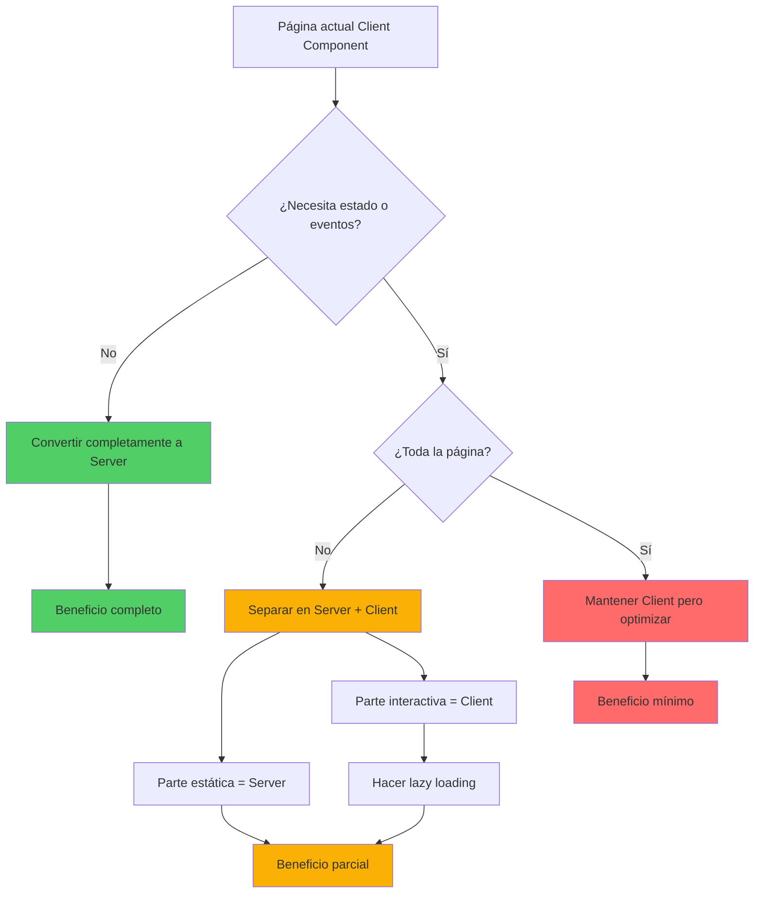

### Decisión: ¿Framer Motion o CSS?

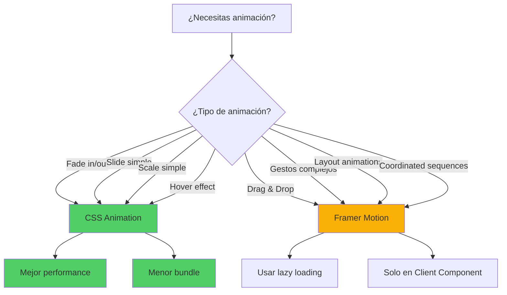

---

## 📊 Estrategia de Carga

### Bundle Splitting Strategy

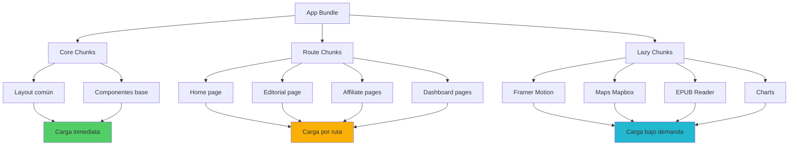

---

## 🎯 Modelo de Priorización

### Matriz de Refactorización

```mermaid
quadrantChart
    title Prioridad de Refactorización
    x-axis Bajo Impacto --> Alto Impacto
    y-axis Bajo Esfuerzo --> Alto Esfuerzo
    
    quadrant-1 Hacer después
    quadrant-2 Hacer ahora (Quick Wins)
    quadrant-3 Evaluar necesidad
    quadrant-4 Planificar bien
    
    Home Page: [0.9, 0.8]
    Editorial: [0.85, 0.7]
    Header: [0.95, 0.5]
    CSS Global: [0.9, 0.2]
    Servicios: [0.6, 0.3]
    Dashboard: [0.7, 0.9]
    Properties: [0.75, 0.75]
    Affiliates: [0.8, 0.7]
```

---

## 🔄 Pipeline de Implementación

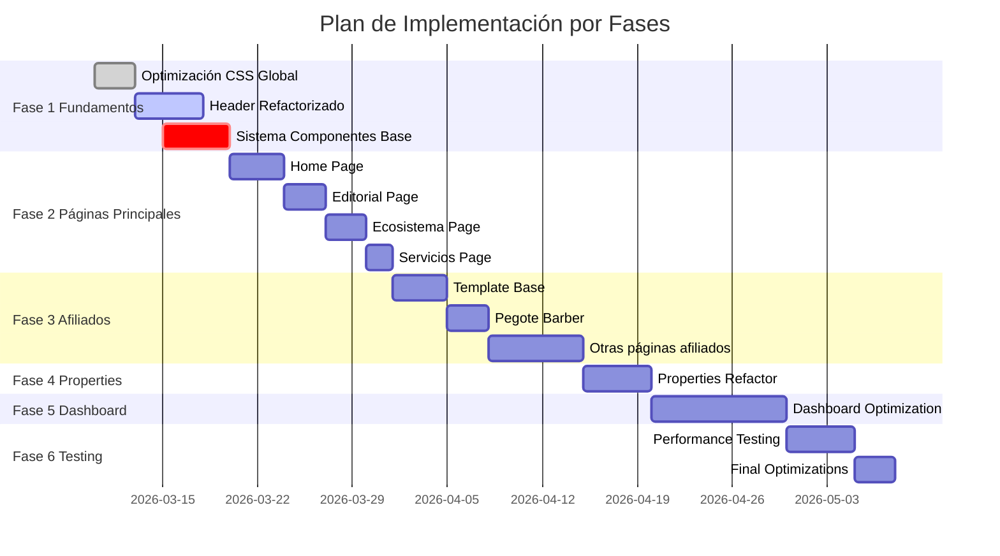

---

## 📈 Métricas de Performance

### Comparación Antes/Después

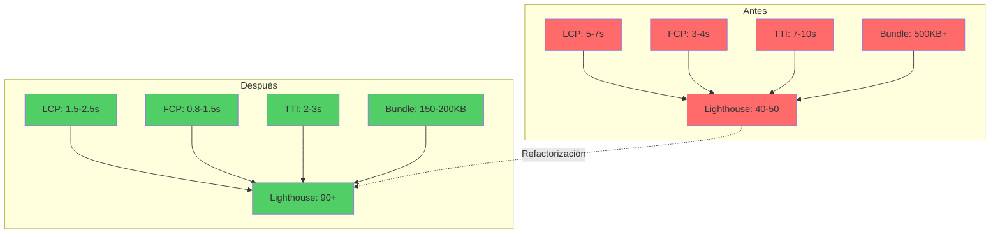

---

## 🎨 Flujo de Animaciones

### Estrategia de Animación

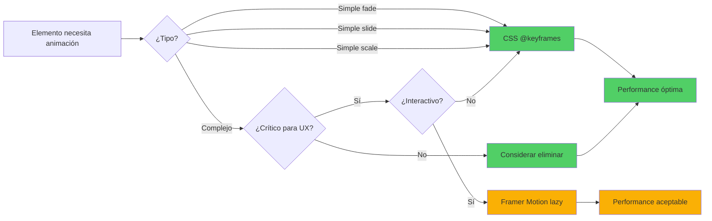

---

## 🚀 Mejoras Esperadas

### Impacto Visual por Métrica

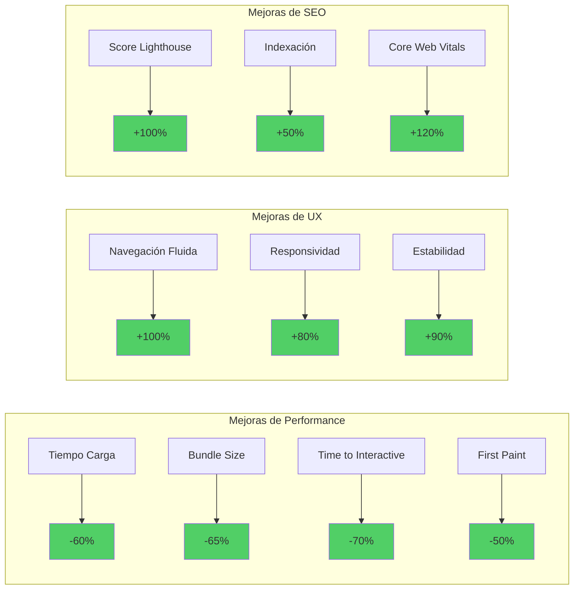

---

## 🎯 Resumen de Transformación

### De Monolito Client a Arquitectura Híbrida

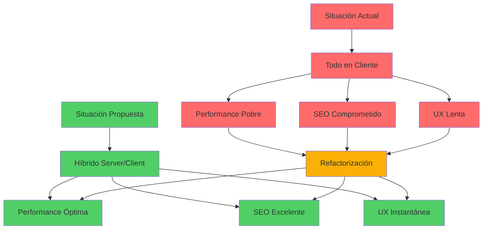

---

**Documento creado:** 2026-03-10  
**Versión:** 1.0  
**Relacionado con:** [Plan Maestro de Optimización](./performance-optimization-master-plan.md)
